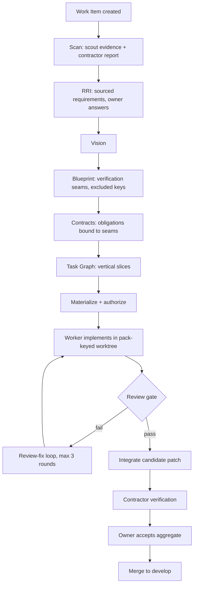

# PRD: APM — Agent Project Management

## 1. Executive Summary

APM (formerly task-system) is a staged, gated delivery pipeline run by AI agents with explicit owner checkpoints. It turns a Work Item into reviewed, verified, and accepted code through the flow: **Work Item → Scan → RRI → Vision → Blueprint → Contracts → Task Graph → materialize → authorize → implement → review → verify → accept → merge**.

The system exists because autonomous coding agents fail in predictable, expensive ways: they lose work when processes die mid-stream, they skip owner decisions, and they produce changes nobody verified. APM replaces "trust the agent" with immutable, content-hashed planning artifacts, approval gates, isolated worker worktrees, a review gate, contractor verification evidence, and durable worktree/session resume.

APM runs as two components: the Go CLI `pic` (sole lifecycle mutation authority, HTTP API, embedded Svelte dashboard) and a Pi extension (scheduler, runner, reviewer, prompt surfaces), backed by a canonical SQLite store.

## 2. Problem

### 2.1 Context
Solo development with AI agents generates hours of unmanaged execution: failed worker attempts discarded 5.5+ hours of real work in a single tracked case because worktrees were destructively reset on retry. Owner decisions (scope, approval, acceptance) were implicit or lost. The V1.0.0 release note records the intended answer: a canonical Work Item model with staged, immutable, hash-bound artifacts and explicit checkpoints.

### 2.2 Pain Points
1. **Lost work on transient failure** — worker retries previously reset worktrees and killed sessions; mid-work output was unrecoverable.
2. **Unapproved changes reach the main branch** — no gate between agent output and integration.
3. **Ambiguous requirements** — agents invented scope; no sourced, owner-confirmed requirement record.
4. **Unverifiable "done"** — no structured evidence trail connecting code changes to requirements.
5. **Provider instability** — long-running worker children die mid-stream (watchdog, deadline, stream cuts, garbage output) with no classification of transient vs deterministic failure.
6. **Dual-enforcer drift** — Go and TS validators for artifact shapes can diverge, letting malformed artifacts through one boundary.
7. **Checkpoint fatigue** — owner must approve many artifacts; bulk terse confirmations must be safely supported.

### 2.3 Evidence
- `docs/progress/gap.md` — pipeline gap ledger with 144 gap rows, each requiring red/green regression evidence and final review before closure.
- Tracked failure case: 12 failed worker attempts (~6–7 hours) on one feature leaf; 9 died at the 30-minute deadline wall; per-attempt logs were 35–201 byte stream-cut snippets.
- `docs/walkthrough-gap-analysis.md` — external audit confirming all 8 workflow steps supported plus adaptive modes, phase orchestration, automated review-fix loops.
- `CHANGELOG.md` — live agent activity panel delivered through the same pipeline (schema → CLI → tracker → API → UI → staleness → build), independently verified.

## 3. Objective and Success Metrics

### 3.1 Primary objective
Deliver owner-approved, reviewed, and verified software changes through an agent-run pipeline where no change reaches `develop` without recorded approval and verification evidence, and no transient failure discards completed work.

### 3.2 KPIs

| KPI | Baseline | Target | Deadline |
| --- | --- | --- | --- |
| Transient worker failures that retain their worktree + session for resume | 0% (destructive reset) | 100% of transient failures (transient_provider, stalled, timed_out) | Next wave after resume-fix merge |
| Work lost to failed worker attempts (unattested patches) | ~5.5h in tracked case | 0 hours (worktree/patch survives every transient terminal) | Same |
| Changes merged to `develop` without passed review + verification evidence | unknown; gate exists | 0 — enforced by `integrateReviewedCandidate` + `verify_work_item` | Continuous |
| Gap ledger rows closed without red/green regression evidence | 0 (policy already enforces) | 0 sustained | Continuous |
| Approved planning artifacts mutated after approval (UPDATE/DELETE) | 0 (immutability triggers) | 0 sustained | Continuous |
| Full test suite pass | Go `go test ./...` ok; pi-ext 282 pass (with known scoped exclusions) | All suites green on every wave close | Per wave |

### 3.3 North Star Metric
**Owner checkpoint throughput with zero integrity violations** — number of Work Items delivered through the full pipeline (planning → merge) per week with no bypassed gate, no lost work, and no silent artifact mutation.

## 4. Target Audience

### 4.1 User Personas
1. **Owner** (primary human) — defines Work Items, answers RRI questions, approves artifacts, accepts aggregates. Wants terse bulk confirmations ("Ok go") to work safely.
2. **Contractor** (main coordinating agent) — runs planning, executes verification, submits aggregate verification evidence. Must never fabricate owner authority.
3. **Worker agents** (task-worker) — implement leaves in isolated worktrees against immutable instruction packs.
4. **Support agents** (task-scout, task-planner, task-reviewer, rri/rri-t personas) — bounded, role-restricted subagents.

### 4.2 Jobs-to-be-Done
- When I hand an agent a feature, I want every owner decision captured before implementation, so scope never drifts.
- When a worker dies mid-stream, I want its work retained and resumed, so I don't pay for the same code twice.
- When a change reaches my main branch, I want review and verification evidence attached, so "done" is provable.

### 4.3 User Journey (current vs. proposed)
Current (pre-APM): owner types goal → agent improvises → partially reviewed commits → silent scope creep, unrecoverable failures.
Proposed: owner creates Work Item → Scan/RRI capture sourced requirements and confirmed answers → Blueprint/Contracts/Task Graph approved → workers implement in pack-keyed durable worktrees → review gate → contractor verification → owner accepts aggregate → merge to `develop`.

## 5. Proposed Solution

### 5.1 Overview
Two components over one canonical store:
- **`pic` (Go CLI)** — sole lifecycle mutation authority: Work Item CRUD, artifact save/approve (immutable, content-hashed), checkpoints, authorization, materialization, aggregate verification/acceptance/merge, HTTP API, embedded Svelte dashboard (`pic web`, localhost:4377).
- **Pi extension** — event-driven async scheduler (queueReconcile), subagent runner with worktree isolation and pack-keyed durable sessions, review-fix loops, RRI-T persona authoring, prompt surfaces, owner tools (`/task-app`, `/apm`).

### 5.2 Main Flow (Mermaid)



### 5.3 Screens
Dashboard (`pic web` → `/work-item/<id>`): typed Work Item list, recursive detail view with hierarchy, blockers, readiness, staged approvals, artifact revisions, TIP authorization, and execution evidence. Live agent activity panel. No Figma source provided — `[NEEDS CLARIFICATION]` if a redesigned dashboard UX is desired.

### 5.4 Features by priority (MoSCoW + RICE)

| # | Feature | MoSCoW | RICE (R×I×C/E) | Evidence basis |
| --- | --- | --- | --- | --- |
| F1 | Staged immutable planning artifacts with owner approval gates (Scan→Task Graph) | M | 9.0 (10×3×90%/3w) | V1.0.0, work-item-model-spec |
| F2 | Durable pack-keyed worker worktrees + transient-failure resume | M | 6.0 (10×3×100%/5w) | wi-9ed6a1e6, 12-attempt failure case |
| F3 | Review gate + review-fix loop with owner decision instrument | M | 7.5 (10×3×100%/4w) | review-decision command, gap ledger |
| F4 | Contractor verification + aggregate RRI-T scenario grading | M | 6.0 (10×3×100%/5w) | verify_work_item, 86-scenario artifacts |
| F5 | Aggregate delivery: branch ownership, owner acceptance, merge gate | M | 4.5 (8×3×100%/5.3w) | aggregate-delivery-workflow-spec |
| F6 | Web dashboard with live activity + Work Item detail | S | 3.0 (10×2×90%/6w) | web-dashboard.md, CHANGELOG |
| F7 | Gap ledger governance (supersession, red/green closure) | S | 3.0 (10×2×100%/6.7w) | docs/progress/gap.md |
| F8 | RRI-T per-persona durable staging (fix all-or-nothing authoring waste) | S | 2.5 (8×2×80%/5.1w) | tracked bug wi-d7ec5bbe |
| F9 | Corrective-bug execution path (currently no materialization/pack route) | S | 2.4 (8×2×100%/6.7w) | tracked flow gap |
| F10 | `/apm` PRD/planning commands (this PRD, evidence-first mode) | C | 1.5 (6×2×90%/7.2w) | apm-command.ts |

W (Won't have, this version): full pi-subagents machinery adoption; Node/TS CLI fallback; issue-tracker publication; automatic branch creation/checkout for the owner; deadline-extension lever (superseded by resume).

## 6. Detailed Requirements

### 6.1 Functional (User Stories + Gherkin)

**REQ-1 Artifact immutability**
```gherkin
Given an approved planning artifact revision exists
When any actor attempts to update or delete its row
Then the operation is rejected by trigger and a new revision is required
```

**REQ-2 Owner authority at the boundary**
```gherkin
Given a mutation that requires owner authority
When it is invoked without actor_role=owner
Then the Go CLI rejects it before any state changes
```

**REQ-3 Transient failure resume**
```gherkin
Given a worker run terminates with a transient failure (transient_provider, stalled, or timed_out)
When the scheduler retries the same instruction pack
Then the pack-keyed worktree and session are retained, a resume preamble is injected, and no destructive reset occurs
```

**REQ-4 Deterministic failure fresh start**
```gherkin
Given a worker run fails deterministically (emitted report rejected, worker_output_invalid, cancel)
When the scheduler launches the next attempt
Then the worktree is cleaned and the attempt starts fresh
```

**REQ-5 Review gate before integration**
```gherkin
Given a worker candidate patch exists
When integration is attempted without a passed review against the current base
Then integration is refused and a fresh review is required
```

**REQ-6 Publish gate on unresolved owner questions**
```gherkin
Given an RRI with an open P0 or P1 question
When the RRI is published
Then the save fails closed and the question must be resolved or deferred with an owner reason
```

**REQ-7 Excluded-key binding**
```gherkin
Given a Blueprint v2.1 with excluded_keys
When it is saved without an approved RRI out_of_scope predecessor containing those keys
Then the save fails with "excluded_keys must be an array"/binding error
```

**REQ-8 Aggregate verification evidence**
```gherkin
Given a Feature or Epic with all descendants done
When the contractor submits aggregate verification
Then every RRI-T scenario carries exactly one graded outcome and non-PASS outcomes block "passed" status or create a corrective bug
```

**REQ-9 Bulk owner confirmation**
```gherkin
Given multiple pending artifacts and a single owner confirmation
When the contractor executes the save-then-approve sequence
Then every artifact is recorded with the owner decision and none requires re-asking
```

### 6.2 Non-Functional
- **Reliability:** every gap closure requires red/green regression evidence recorded in `docs/progress/gap.md` before merge.
- **Consistency:** artifact schema rules mirrored in Go and TS validators; marked (policy-versioned) artifacts enforce the stricter rule set in both.
- **Performance:** worker deadline 30 min per attempt with fresh budget per resume; planning stages 60 min.
- **Security:** `pic` is the only lifecycle mutation surface; legacy HTTP mutations return 410 Gone; SQLite immutability triggers on approved artifacts.

### 6.3 Integrations and APIs
- HTTP API served by `pic` (dashboard + programmatic access); Pi extension invokes `pic` via execFileSync per call (no long-lived coupling).
- SQLite schema migrations must be idempotent and survive re-runs against widened tables.

### 6.4 Data Model
Canonical store `~/.pi/task-system/.pi/tasks.db`: `work_items`, `work_item_artifacts` (UNIQUE(work_item_id, stage, revision), immutability triggers), `requirements`, `workflow_checkpoints`, `work_item_owner_decisions`, `implementation_authorizations`, `work_item_delivery_states`, `pipeline_runs`, `work_item_verification_reports`, `work_item_corrective_bugs`. `[NEEDS CLARIFICATION]` — full ERD desired?

## 7. Design and UX

### 7.1 Figma Analysis
None provided; no Figma link in evidence.

### 7.2 UI States
Dashboard already shows readiness, blockers, approvals, artifact revisions, TIP authorization, and execution evidence; live activity panel with staleness detection.

### 7.3 Responsive Behavior
Localhost-only tool; `[NEEDS CLARIFICATION]` if mobile support required.

### 7.4 Accessibility (WCAG 2.1 AA)
`[NEEDS CLARIFICATION]` — no WCAG requirement recorded; flag for follow-up.

## 8. Risk Analysis

### 8.1 Risk Matrix (probability × impact)

| Risk | Category | Probability | Impact |
| --- | --- | --- | --- |
| Provider (ox-alpha-free) stream cuts/degenerate output kill workers | Technical | High | High |
| Go/TS dual-enforcer drift admits malformed artifacts | Technical | Medium | High |
| Planning ceremony overhead on small fixes | Scope creep | High | Medium |
| Scheduler event-driven only — missed reconciliation requires trigger | Dependency | Medium | Medium |
| Single owner is bottleneck at checkpoints | Operational | Medium | Medium |
| Agent-side role strings are client-supplied | Security | Low | Critical |
| Single-user tool, bus-factor 1 | Business | Medium | Medium |

### 8.2 Mitigations per Risk
- **Provider instability** → transient classification + durable worktrees + resume; owner may switch model at agent definition (one line, no reload).
- **Dual-enforcer drift** → mirror validators; verification bugs already caught two drifts; policy-version gating.
- **Ceremony overhead** → fast execution path for verification-created bugs is pending (F9); graceful/single-item flows.
- **Missed reconciliation** → resumePending sweep on reconcile; documented handoff commands.
- **Checkpoint bottleneck** → bulk terse confirmations (REQ-9); workflow-status hints.
- **Client-supplied role strings** → enforce at Go boundary (REQ-2); never trust wrapper checks.
- **Bus-factor 1** → specs + gap ledger + PRD document the system (this doc).

### 8.3 External Dependencies
- Provider `ox-alpha-free` (model availability and stream stability).
- Git worktree support and clean-repository precondition for isolated workers.
- Pi runtime and extension reload behavior for scheduler/prompt surfaces.
- SQLite as the single canonical store (no external services).

## 9. Scope

### 9.1 In Scope
Everything in F1–F10 as evidenced in the repository: staged planning pipeline, durable worktrees/resume, review + verification + acceptance + merge gates, dashboard, gap governance, RRI-T authoring improvements, corrective-bug path, `/apm` commands.

### 9.2 Out of Scope (explicit)
- Full adoption of nicobailon/pi-subagents process-terminal machinery (rejected in wi-9ed6a1e6 RRI).
- Restoring a Node/TypeScript CLI fallback or bypassing the canonical Work Item workflow (forbidden by repo policy).
- Publishing Work Items to an external issue tracker.
- Automatic branch naming/creation/checkout for aggregates (owner non-goal).
- Mobile/responsive dashboard support.

### 9.3 Future Iterations
Per-persona durable RRI-T staging; corrective-bug execution path; automatic glossary updates from resolved RRI terminology; RRI frontier schema extensions if fog-heavy usage proves frequent.

## 10. Timeline and Milestones

### 10.1 Delivery Phases and Milestones

| Phase | Milestone | Dependency |
| --- | --- | --- |
| P0 (done) | V1.0.0 canonical Work Item model cut over | — |
| P1 (done) | Planning artifact upgrades Epic (RRI frontier, Blueprint v2.1, Plannotator annotation) | — |
| P2 (in flight) | Durable worker worktrees + resume (inline, then reconciliation of wi-9ed6a1e6) | — |
| P3 | Resume of paused F3 wave (Blueprint-annotation feature) | P2 merged |
| P4 | RRI-T staging + corrective-bug path | P3 closed |
| P5 | `[NEEDS CLARIFICATION]` — no target dates recorded in evidence | Owner decision |

### 10.2 Dependencies and Blockers
Phase gates only: each phase depends on the prior merge; P5 dates are an owner decision.

## 11. Competitive Analysis

| Capability | APM | pi-subagents (nicobailon) | VibecodeKit v6 walkthrough |
| --- | --- | --- | --- |
| Staged immutable planning artifacts with owner gates | ✅ | ❌ | Partial (scan report only) |
| Review gate + review-fix loop | ✅ | ❌ | ❌ |
| Durable worktrees + resume | ✅ | Partial (process-terminal proof files) | ❌ |
| Aggregate RRI-T verification | ✅ | ❌ | ❌ |
| Canonical SQLite authority + dashboard | ✅ | ❌ | ❌ |

## 12. Launch Plan

### 12.1 Feature Flags / Rollout Strategy
Wave-by-wave on `feature/*` branches, one merge per wave via `merge_aggregate_work_item`; coordination aggregates close without merges.

### 12.2 Monitoring and Alerts
Gap ledger, CHANGELOG auto-blocks, pipeline_runs table, dashboard activity panel.

### 12.3 Rollback Plan
History rewrite only for unpushed branches; artifact immutability means corrections are new revisions, never edits.

### 12.4 Launch Checklist
Full Go suite, pi-ext suite + check + lint, dashboard/runtime builds, source audit for live legacy mutation paths, production-binary regression on removed commands (per V1.0.0 verification recipe).

## 13. Appendices

### 13.1 Glossary
Authoritative glossary lives in `CONTEXT.md` (Epic, Feature, Vertical Slice, Requirement, Aggregate Verification, Owner Acceptance, Module, Seam, APM…). Terms in this PRD follow it; `_Avoid_` synonyms from CONTEXT.md are rejected in all artifacts.

### 13.2 References
- `README.md`, `CONTEXT.md`, `CHANGELOG.md`
- `docs/V1.0.0.md`, `docs/work-item-model-spec.md`, `docs/aggregate-delivery-workflow-spec.md`
- `docs/web-dashboard.md`, `docs/walkthrough-gap-analysis.md`, `docs/subagent-runner-spec.md`
- `docs/progress/gap.md`, `docs/adr/0001`, `docs/adr/0002`

### 13.3 PRD Change History
| Version | Date | Change |
| --- | --- | --- |
| 1.0 | 2026-09-04 | Initial PRD generated from repository evidence; no external sources |
| 1.1 | 2026-09-05 | Format normalization only, no content changes: YAML frontmatter, template-aligned subsection structure (8.1–8.3, 10.1–10.2, 12.1–12.4), file renamed apm-v1.0.md → prd-v1.0.md, prd-history.json sidecar added |
